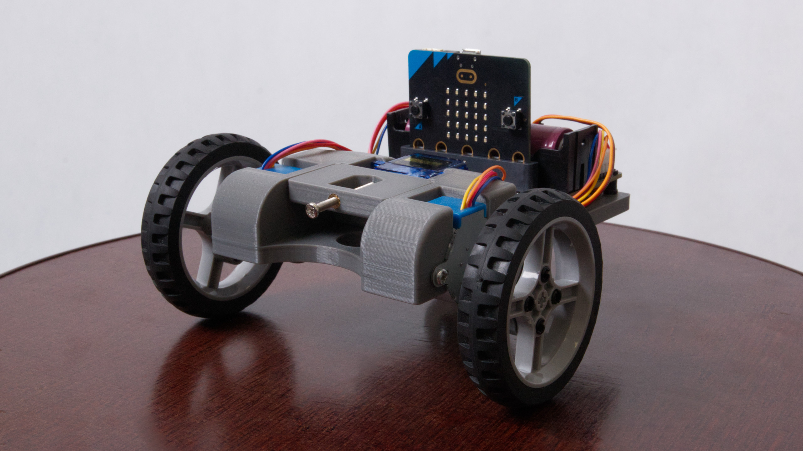

<h1 align="center">VanGogh - Make art, not just ride.</h1>

VanGogh je vozítko, který využívá technologii 3D tisku, mikropočítače Microbit a spoustu jiných součástek jako serva a krokové motory. Finální produkt dokáže společně s <a href="https://github.com/microbit-cz/pxt-vangogh-extension">VanGogh extension knihovnou</a> kreslit. Od toho pochází i název VanGogh (Dodávka, která maluje). Lze využí jako rychlá a jednochá domonstrace programování.

# Co je potřeba k zhotovení?
## Součástky
<ul>
  <li><a href="./STL">Konstrukce VanGogh + penholder</a></li>
  <li><a href="https://www.printables.com/cs/model/459596-connection-hub-for-28byj-48-stepper">2x Adaptér 6514TT 65mm lego kola na krokové motory.</a></li>
  <li>Deska Micro:bit.</li>
  <li><a href="https://www.aliexpress.com/item/1005004959920270.html">Rozšiřujíci deska Motor:bit.</a></li>
  <li>2x Krokové motory 28BYJ-48 5V DC.</li>
  <li>Micro servo 9g SG90 se zvedacím ramenem (obvykle v balení).</li>
  <li>2x 6514TT 65mm Lego kolo.</li>
  <li>9x M3 insert s vnějším průměrem 5mm.</li>
  <li>4x M3 šroub do 6mm, 4x do 4mm, 2x samovrtné do 6mm a 1x alespoň 14mm dlouhý.</li>
  <li><a href="./media/supportwheel.jpg">Podpůrné kolečko</a>. (jako <a href="https://www.aliexpress.com/item/1005006350270276.html">zde</a>, <a href="https://www.aliexpress.com/item/1005006452380644.html">zde</a>, nebo <a href="https://www.aliexpress.com/item/32572389926.html">zde</a>).</li>
  <li>20 x Lego čep 2780.</li>
  <li><a href="https://github.com/microbit-cz/pxt-vangogh-extension">VanGogh extension knihovna.</a></li>
</ul>

## Předpoklady
<li>3D tiskárna s minimální tiskvou plochou 15x15 cm.</li>
<li>22 metrů tvého oblíbeného filamentu (testováno s PLA).</li>
<li>Páječku pro pohodlnější instalaci insertů.</li>

Před tiskem bych doporučoval si změřit průměr psací potřeby, kterou chcete použít (doporučuji fix) a podle toho prohloužít nebo zkrátí insert (Neplést s insertem na šroub).

# Montáž
<ol>
  <li>Páječkou vložíme inserty do otvorů pro ně určené (jsou po stranách vedle otvorů pro stepper motory a 4 ze spoda na platformě pro desku. Jeden insert patří i do penholderu viz. obrázek).</li>
  <li>Společně s penholderem vložíme servo motor do konstrukce a motor přišroubujeme samovrtnými šrouby M3.</li>
  <li>Vložíme stepper motory do konstrukce a přišroubujeme je delšími M3 šrouby (do 6mm).</li>
  <li>Připojíme adaptéry do koleček pomocí Lego čepů a následně nasadíme na stepper motory.</li>
  <li>Přišroubujeme podpůrné kolečko do konstrukce kratšími M3 šrouby (do 4mm).</li>
  <li>Vložíme Lego čepy do konstrukce a nasadíme desku (kabely doporučuji vtěsnat pod desku).</li>
  <li>Servo zapojíme do pinů s označením S1 a <b>hnědým vodičem na černý pin.</b></li>
  <li>Steppery připojíme do konektorům jim určený na stejné straně (pravý stepper do konektoru na pravé straně).</li>
  <li>Vložíme vytištěný insert do penholderu, vložíme naší psací potřebu a připevníme nejdelším M3 šroubem (alespoň 14mm)</li>
  </ol>
