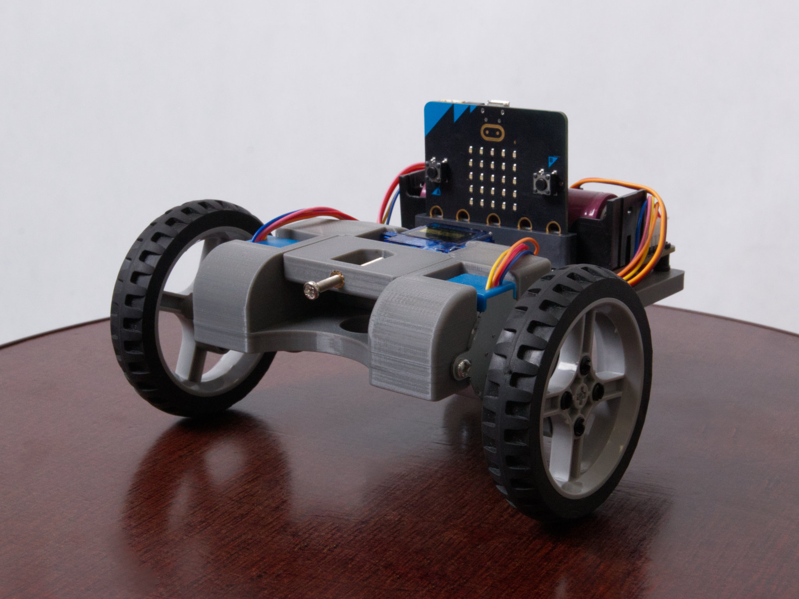

<h1 align="center">VanGogh - Drive art, not just the direction!</h1>

VanGogh is a vehicle that uses 3D printing technology, Microbit microcomputer, and lots of other components like servos and stepper motors. The final product can draw together with the <a href="https://github.com/microbit-cz/pxt-vangogh-extension" target="_blank">VanGogh extension library.</a> Hence the name VanGogh (The van that paints). Also it can be used as a quick and easy demonstration of programming.

# What do I need?
## Components
<ul>
  <li><a href="./STL" target="_blank">VanGogh construction + penholder.</a></li>
  <li><a href="https://www.printables.com/cs/model/459596-connection-hub-for-28byj-48-stepper" target="_blank">2x Adapter 6514TT 65mm lego wheel for 28BYJ-48 5V DC stepper motor.</a></li>
  <li>Micro:bit board.</li>
  <li><a href="https://www.aliexpress.com/item/1005004959920270.html" target="_blank">Motor:bit expansion board.</a></li>
  <li>2x Stepper motor 28BYJ-48 5V DC.</li>
  <li>Micro servo 9g SG90 with a lifting arm (Usually packed with servo).</li>
  <li>2x 6514TT 65mm lego wheel.</li>
  <li>9x M3 Insert with outer diameter 5mm.</li>
  <li>4x M3 screw up to 6mm, 4x up to 4mm, 2x self drilling up to 6mm and 1x at least 14mm long.</li>
  <li>Support wheel.</li>
  <li>12x Lego pin 2780.</li>
  <li><a href="https://github.com/microbit-cz/pxt-vangogh-extension" target="_blank">VanGogh extension library.</a></li>
</ul>

## Prerequisites
<li>3D printer with minmal 15x15 cm printing space.</li>
<li>22 meters of your favorite filament (Tested on PLA).</li>
<li>Solder for easy installation of inserts.</li>

Before printing, I would recommend measuring the diameter of the writing utensil you want to use (I recommend a marker) and lengthen or shorten the insert "VanGoghPenHolderInsert" accordingly.

# Assembly
<ol>
  <li>Insert the inserts with a solder into the holes provided for them (they are on the sides next to the holes for the stepper motors and 4 from the bottom on the platform for the board. One insert also belongs to the penholder, you can see in the picture)</li>
  <li>Together with the penholder insert the servo motor with lifting arm into the construction and screw the motor with self-drilling screws M3.</li>
  <li>Insert the stepper motors into the structure and screw them with longer M3 screws (up to 6mm).</li>
  <li>Attach the adapters to the wheels with Lego pins and then fit in the stepper motors.</li>
  <li>Screw the support wheel into the structure with shorter M3 screws (up to 4mm).</li>
  <li>Insert the Lego pins into the structure and mount the board (I recommend to squeeze the cables under the board).</li>
  <li>Connect the servo to the pins marked S1 <b>(brown wire to the black pin).</b></li>
  <li>Connect the steppers to their connectors on the same side (right stepper to the connector on the right side).</li>
  <li>Insert the printed insert into the penholder, insert pen and attach with the longest M3 screw (at least 14mm).</li>
</ol>
